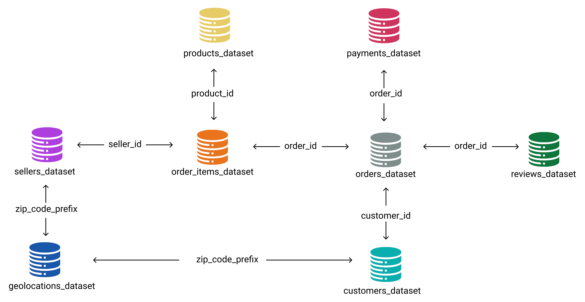
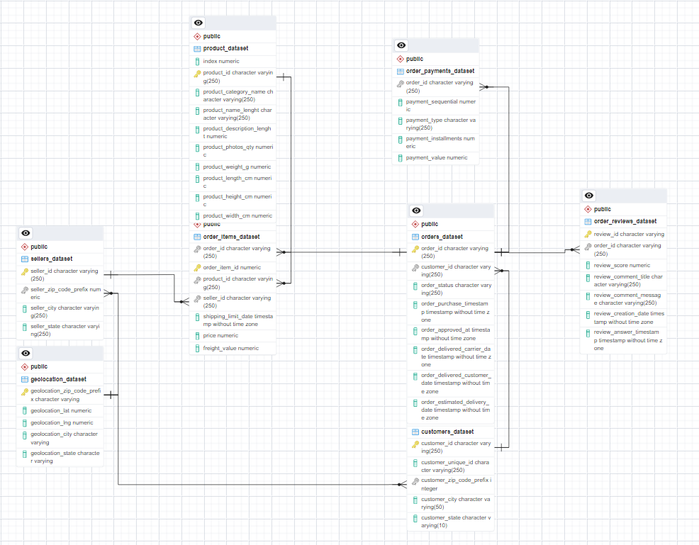
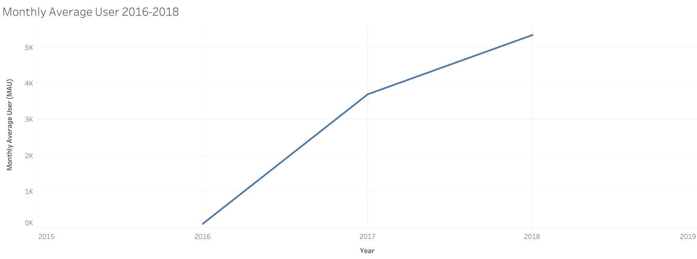
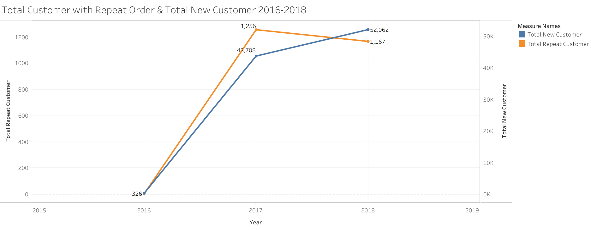
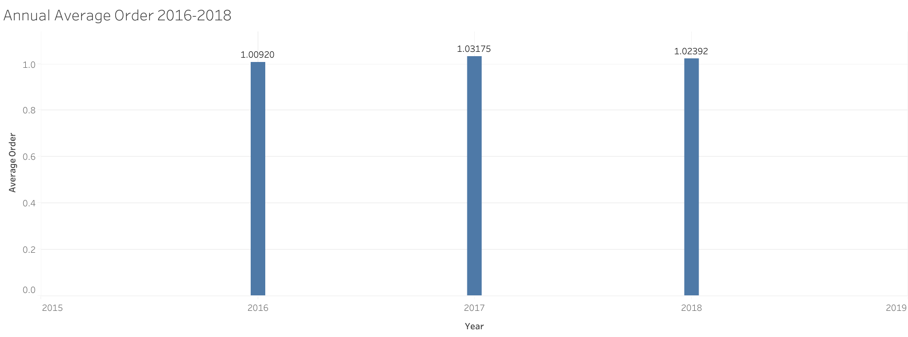

# Analyzing eCommerce Business Performance with SQL
Dataset : [Ecommerce Dataset](https://github.com/jedijm/Analyzing-eCommerce-Business-Performance-with-SQL/tree/master/Dataset) - Rakamin Academy 
 
Tools : PostgreSQL & Tableau Public

## Project Background
The dataset analyzed in this project comes from one of the biggest e-commerce company in South America. The company is a marketplace that connects micro-scale sellers and the customers. The company wants to analyze the customer growth, product quality and payment types through this project. The project is performed by me as a Data Analytics team of the company.

## Data Preparation
This stage is a fundamental before beginning the data processing. This stage purpose is to turn the raw data into structured data. The steps in this stage are as of below:
1. Create the database with its tables.
2. Import the csv data into the database.
3. Create the Entity Relationship Diagram (ERD) based on scheme in Fig 1. Data Relationship.

 Fig 1. Data Relationship 

From the scheme above, the primary key and foreign key from columns of the table is defined to connect each of the tables in database. Then, the ERD can be generated as in Fig 2. 

 Fig 2. Entity Relationship Diagram 

## Data Analysis
In this stage, there are 3 metrics used:
1. Annual Customer Activity Growth Analysis
Annual Customer Activity Growth can be analyzed from:
- **Monthly Active User (MAU)**
- **Total New Customer**
- **Total Customer with Repeat Order**
- **Average Order of customer**
 

 
  
 

 Fig 3. Annual Customer Activity Growth Summary 
 

 Fig 4. Monthly Active User (MAU) 

Fig 4. shows a positive trend of Monthly Active User from 2016-2018. The increase of MAU in 2018 is not as high as in 2017.
 

 Fig 5. Total New Customer & Total Repeat Order Customer 

Fig 5. shows that both Total New Customer (TNC) and Total Repeat Order Customer (TROC) increased in 2016-2017 period, but there is a different trend in 2017-2018. TNC has a positive trend but conversely for the TROC.
 

 Fig 6. Average Order 

Fig 6. shows that the average order of customer is only 1, or that most of the customers don't do repeat order in 2016-208.

