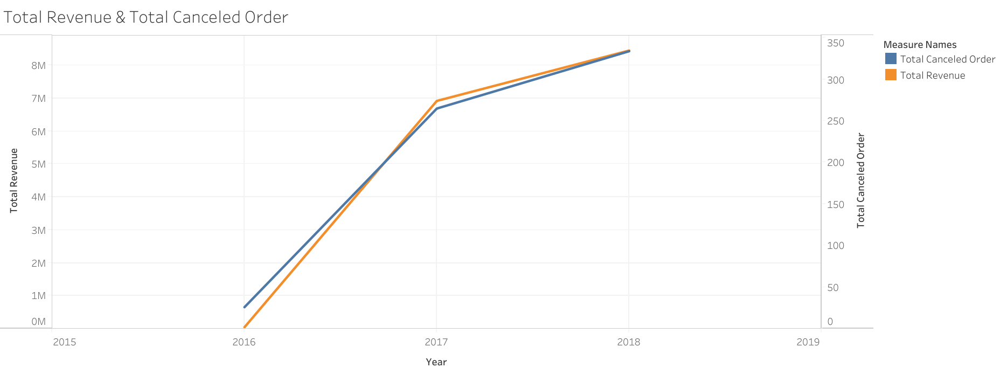
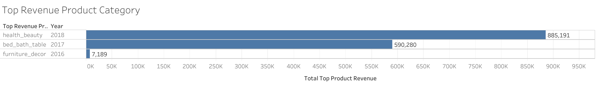
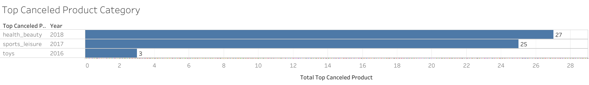
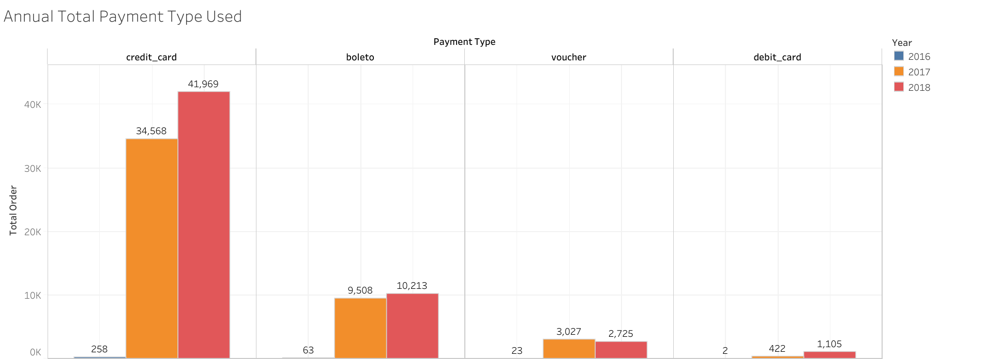

# **Analyzing eCommerce Business Performance with SQL**
Dataset : [Ecommerce Dataset](https://github.com/jedijm/Analyzing-eCommerce-Business-Performance-with-SQL/tree/master/Dataset) - Rakamin Academy 
 
Tools : PostgreSQL & Tableau Public

## **Project Background**
The dataset analyzed in this project comes from one of the biggest e-commerce company in South America. The company is a marketplace that connects micro-scale sellers and the customers. The company wants to analyze the customer growth, product quality and payment types through this project. The project is performed by me as a Data Analytics team of the company.

## **Data Preparation**
This stage is a fundamental before beginning the data processing. This stage purpose is to turn the raw data into structured data. The steps in this stage are as of below:
1. Create the database with its tables.
2. Import the csv data into the database.
3. Create the Entity Relationship Diagram (ERD) based on scheme in Fig 1. Data Relationship.

 Fig 1. Data Relationship 

From the scheme above, the primary key and foreign key from columns of the table is defined to connect each of the tables in database. Then, the ERD can be generated as in Fig 2. 

 Fig 2. Entity Relationship Diagram 

## Data Analysis
In this stage, there are 3 metrics used:
 
### 1. **Annual Customer Activity Growth Analysis**
Annual Customer Activity Growth can be analyzed from:
- **Monthly Active User (MAU)**
- **Total New Customer**
- **Total Customer with Repeat Order**
- **Average Order of customer**

 
  
 

 Fig 3. Annual Customer Activity Growth Summary 

 Fig 4. Monthly Active User (MAU) 

Fig 4. shows a positive trend of *Monthly Active User* from 2016-2018. The increase of MAU in 2018 is not as high as in 2017.

 Fig 5. Total New Customer & Total Repeat Order Customer 

Fig 5. shows that both Total New Customer (TNC) and Total Repeat Order Customer (TROC) increased in 2016-2017 period, but there is a different trend in 2017-2018. TNC has a positive trend but conversely for the TROC. 

 Fig 6. Average Order 

Figure above shows that the *Average Order* of customer is only 1, or that most of the customers don't do repeat order in 2016-2018 period.

### 2. **Annual Product Category Quality Analysis**
The metrics used in annual product category quality analysis are:
- Total Revenue
- Total Canceled Order
- Top Revenue Product Category
- Top Canceled Order Product Category

 
  
 

 Fig 7. Annual Product Category Quality Summary 

 Fig 8. Total Revenue & Total Canceled Order 

Fig 8. shows positive trend for both metrics. The revenue and canceled order experienced the highest rise in 2017 and a little lower in 2018.

 Fig 9. Top Revenue Product Category 

Fig 9. shows product category with the highest revenue each year. in 2016, furniture_decor has the highest revenue for 7.189$, in 2017 bed_bath_table is the highest with 590.280$, meanwhile in 2018 the highest revenue is health_beauty category with 885,191$.

 Fig 10. Top Canceled Order Product Category 

Fig 10. shows product category with the highest canceled order each year. in 2016, toys has the highest canceled for 3 orders, in 2017 sport_leisure is the highest with 25 orders, meanwhile in 2018 the highest revenue is health_beauty category with 27 orders.

### 3. Annual Payment Type Usage Analysis

 
  
 

 Fig 11. Annual Payment Method Usage Summary 

 Fig 12. Annual Total Payment Method Usage 

Fig 12. describes the annual total payment method usage from 2016-2018. It can be seen that every methods have a positive trend except for the voucher that decreased a little in 2018. The most used payment method is credit card and the least is debit card. It needs a deeper analysis from business team to understand the pattern.

## **Summary**
1. Monthly Active User (MAU) shows a positive trend but the repeat order customer is the opposite. This issue should be a warning for the business team to persuade costumer in repetitive order. For instance, giving benefit for the next purchase.
2. Total Revenue and Total Canceled order has the same pattern which is a positive trend each year. The canceled order should be analyzed deeper to understand the causing factor of the canceled order.
3. Product category with highest total revenue and canceled order is different in each year. Predicting which product category will be the highest in both metrics will give huge benefit for the company to focus on several products. This issue can be done by the Data Science team to perform the best model with machine learning.
4. Credit card is the highest payment method used every year and the least used is debit card. The business team should analyze deeper to see the causing factor of it. To distribute the payment method more balance, the business team may give benefit from other payment method such as discount or promos.

